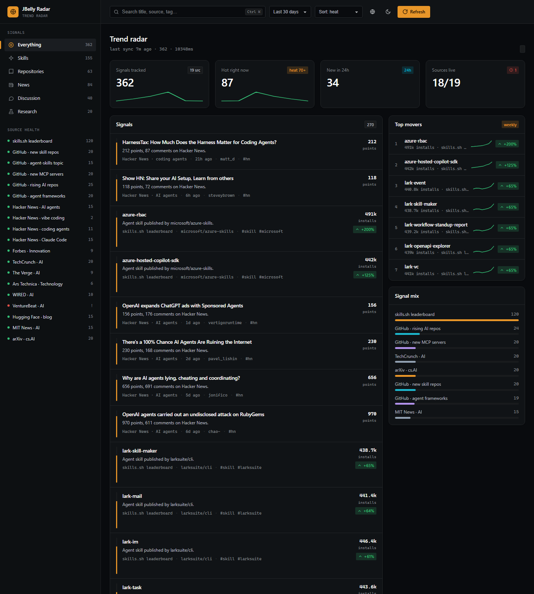

# JBelly Radar

[](https://github.com/jbelly-tech/jbelly-radar/actions/workflows/ci.yml) · MIT + CC BY 4.0 · PowerShell 7 or Windows PowerShell 5.1 · no dependencies, no build step, no API key, **no model call**

When you start a project and choose your tools, the honest answer to *"is there
already a skill or an MCP server that covers this?"* usually comes from a web
search, a leaderboard's front page, or whatever your coding agent happened to
remember. All three answer *what is popular right now*, not *what exists*.
JBelly Radar reads 54 public sources on a schedule, keeps a permanent record of
every item it has ever seen, and answers that question from the record instead —
deterministically, on your own machine, with no model anywhere in the path.

It has two faces. A **dashboard** answers *what changed since yesterday and how
much does it matter to me.* A **catalogue** answers *does something already cover
this requirement, and does anyone actually use it.*



---

## What you get

### 1. The dashboard — what moved

A local page on `localhost:8477`, served by a PowerShell script, that ranks
everything the last sync saw by one explainable *heat* score. Filter by category
and technology, switch **For you** / **Everything**, open *why this is here* on
any row and read the score term by term. English ⇄ Arabic with full RTL, light
and dark, keyboard-reachable throughout. Your reading behaviour stays in your
browser's `localStorage` and is never sent anywhere.

The **radar scope** is the signature view: every signal is a blip, sector =
category, distance from the centre = heat, size = popularity, an outline for
items from notable organisations. It ships with a screen-reader table, because a
chart that only works visually is half a chart.

### 2. The ledger — what exists

`data/ledger.json` is the one file here that a re-run cannot rebuild, so it is
the one generated file that is **committed**. Each row records what an item was
(title, URL, summary, source, category, technology tags, install command,
publisher, usage metric) and when this radar first and last saw it.

That matters because `data/trends.json` holds *one sync, with every source
capped*. Asked against the feed, *"is there a skill for X"* returns "no" when the
truth is "not in today's top N" — the worst possible failure for a question used
to pick a technology. The ledger is not capped and does not forget, so it can be
asked properly. Sources are read at `catalogueMax` depth for the record and
capped at `maxItems` for display; the two are separate settings for exactly this
reason.

### 3. The plan matcher — does anything cover this

`scripts/match-plan.ps1` takes the build section of a solution architecture as
JSON (`config/build.example.json` is the format by example) and reports, per
requirement, whether the catalogue already holds a skill or an MCP server that
covers it.

```powershell
pwsh -File scripts/match-plan.ps1 -Plan config/build.example.json
```

```
catalogue: 2666 named rows (800 skills, 443 MCP servers), 298 anonymous
usage floor (catalogue median): skill 82,554, mcp 8,233

requirement        status    hits   strongest
auth               covered   7      supabase-postgres-best-practices
payments           covered   11     stripe-best-practices
assistant          covered   168    @typia/mcp
observability      covered   14     google-agents-cli-observability
search             thin      3      yuezhiai/jonex
pdf-extraction     covered   8      pdf
invoicing-ledger   manual    0
```

It writes a bilingual Markdown report next to that summary. Three design choices
are worth knowing before you trust it:

- **`mode` picks the pool.** `build` searches skills, `runtime` searches MCP
  servers. They solve different problems and mixing them is noise.
- **A keyword matching more than a quarter of its pool is dropped and named in
  the report.** Measured: with `mode: runtime` the pool is already only MCP
  servers, so the keyword `mcp` matched all of them, every candidate scored the
  same, and the report cheerfully announced "covered" with a random server on
  top. A keyword that does not narrow is not evidence.
- **The usage floor is the catalogue's own median, recomputed each run.** Skills
  and MCP servers are three orders of magnitude apart in usage, so any number
  frozen into the script would call every MCP server weak, and would rot as the
  catalogue grows.

### 4. The briefs — what it means for an industry

`scripts/brief.ps1` writes a dated, bilingual brief per business vertical (19 of
them), joining the hand-written judgement in `config/taxonomy.json` — *these
technologies matter for this industry, and here is one line of why* — to what the
radar actually saw. Citations are frozen at write time, because at the measured
churn rate a brief pointing at the live feed loses roughly a sixth of its links
within a day.

### 5. The operator console

`http://localhost:8477/app/ops/` — source health, signal coverage, what heat was
computed from, and arrivals by day. Every card says what to do when it goes red,
and one card is deliberately empty and says why: aggregating what readers look at
would be the commercially interesting number, and collecting it is a decision
with a disclosure attached, not a default.

---

## Quick start

**What it needs.** PowerShell — nothing else. No package manager, no runtime, no
build step, no key. It targets **PowerShell 7**, and still runs on **Windows
PowerShell 5.1**, which ships with Windows and needs no install.

**Honest caveat:** both runtimes have been exercised on Windows. The
platform-specific paths for macOS and Linux — the browser opener, the child
process launcher, the test harness's browser discovery — are written and are not
yet verified on those systems. If you are the first to run it there, an issue
saying what broke is the single most useful contribution right now.

```bash
git clone https://github.com/jbelly-tech/jbelly-radar.git
cd jbelly-radar
pwsh ./radar.ps1
```

On Windows PowerShell 5.1, or if your execution policy blocks local scripts:

```powershell
powershell -ExecutionPolicy Bypass -File radar.ps1
```

`radar.ps1` starts a sync in a child process, serves the dashboard on
`http://localhost:8477/` (localhost only — nothing is exposed to the network)
and opens it. The page follows the sync source by source while it runs. Recent
full syncs took **24–38 seconds**; the sources are fetched 8 at a time, so the
wall clock is roughly the slowest single source plus GitHub's rate limiter.

**Set a GitHub token.** It is listed as optional, and the radar runs without one,
but five sources are GitHub search queries and publisher resolution asks GitHub
about up to 20 unlisted organisations per sync. Unauthenticated, that is 10
search requests per minute and 60 API calls per hour shared across all of it. On
this project's own machine 76 of 578 cached organisation lookups carry a 403.
With a token (no scopes needed) the limit is 5,000/hour:

```powershell
$env:GITHUB_TOKEN = 'ghp_...'
```

### Running it

```powershell
./radar.ps1                  # sync if data is older than 30 minutes, serve, open; re-sync every 20 min
./radar.ps1 -Sync            # sync first, whatever the cache age
./radar.ps1 -NoSync          # serve the cache, never touch the network
./radar.ps1 -Every 10        # background re-sync interval in minutes (0 = off)
./radar.ps1 -Port 9000       # different port
./radar.ps1 -NoOpen          # do not launch a browser

pwsh -File scripts/sync.ps1              # headless sync, for cron or Task Scheduler
pwsh -File scripts/match-plan.ps1        # match a build plan against the catalogue
pwsh -File scripts/brief.ps1 -List       # the verticals a brief can be written for
pwsh -File scripts/pack-demo.ps1         # zip a frozen, double-clickable demo
pwsh -File tests/check.ps1               # the static suite (300 checks)
pwsh -File tests/run-harness.ps1         # the browser harnesses (needs radar.ps1 running)
```

On Windows PowerShell 5.1 replace `pwsh` with
`powershell -ExecutionPolicy Bypass`; everything else is identical.

**On the page.** *Tune your radar* asks for your business and the technologies you
follow (30 seconds, skippable). Chips in the sidebar filter by technology; the
sidebar also shows every source's health. Each row can be saved, hidden (with
undo), or asked *why this is here*. The globe switches English ⇄ Arabic, the moon
switches theme, and `?theme=light&lang=ar` makes any view a link.

Keyboard: `/` or `Ctrl K` search · `f` For you / Everything · `p` profile ·
`r` re-sync · `Esc` closes.

### Scheduled sync

`scripts/sync.ps1` is headless and reports a failed source rather than dying on
it, so it is safe to schedule. Keeping the ledger fed daily is what makes the
catalogue worth asking — it only ever learns from syncs that actually ran.

Linux and macOS, with cron:

```bash
0 8 * * *  cd /path/to/jbelly-radar && /usr/bin/pwsh -NoProfile -File scripts/sync.ps1 -Quiet
```

Windows, with Task Scheduler:

```powershell
$action  = New-ScheduledTaskAction -Execute 'pwsh.exe' `
           -Argument '-NoProfile -File "C:\path\to\jbelly-radar\scripts\sync.ps1" -Quiet'
$trigger = New-ScheduledTaskTrigger -Daily -At 8am
Register-ScheduledTask -TaskName 'JBelly Radar sync' -Action $action -Trigger $trigger
```

---

## How it works

Fetch → normalise → dedupe → classify → attribute → measure → rank → write.
Every step is a script. **There is no model call anywhere in the path**, which is
why the same inputs give the same radar, a sync costs nothing but bandwidth, and
nothing you read leaves the machine.

**Heat** (server-side, identical for every reader) is 0..100 from three parts.
The numbers live in [`config/sources.json`](config/sources.json), not in code:

| Part | Weight | Meaning |
|------|--------|---------|
| **recency** | 0.40 | `exp(-ln2 × age / halfLifeDays)`. News halves every 3 days, releases and discussion every 5, research every 7, skills every 14, repositories every 21. Age comes from the source's own date, or, for an item that has none, from the day this radar first saw it. |
| **popularity** | 0.35 | `log10(1 + metric) / log10(1 + ceiling)` — the first thousand stars count for far more than the twentieth. News and releases carry no such metric; there the publisher's tier stands in, because who published it is the only quality signal those categories have. |
| **momentum** | 0.25 | Change in the metric per week, **measured between two of our own snapshots**. A baseline is only replaced once it is 12 hours old, so two syncs minutes apart report no momentum rather than an invented one. [ADR 0002](docs/adr/0002-momentum-is-measured.md) |

**A term that cannot be measured is dropped, not guessed.** The remaining weights
are renormalised, and the result is scaled by how much of the weight was
measurable (`heat.confidenceFloor`, 0.7) so an item measured on freshness alone
cannot tie with one measured on all three. Every item carries `heatBasis` naming
the terms that were used.

**Personal score** (browser only, *For you* mode only):

```
score = 0.45·heat + 0.20·reputation + 0.20·relevance + 0.15·affinity + explore
```

`reputation` is the publisher tier (1 → 1.0, 2 → 0.75, 3 → 0.5, verified-only →
0.35). `relevance` is how much the item's technologies overlap your profile.
`affinity` is the decayed sum of your opens (+1), saves (+2), hides (−2) and
dwell (+0.5) on a 14-day half-life. `explore` adds 0.04 for technologies you have
never touched, so the feed can still surprise you. Every row can show its terms.
*Everything* mode is pure heat. [ADR 0004](docs/adr/0004-personal-score-is-client-side.md)

**Provenance is a ranking input, not a badge.** A curated tier list of 150
entries — 9 tier 1, 62 tier 2, 79 tier 3 — plus GitHub's own *verified
organisation* record for anyone not on it, so a Cloudflare release and a weekend
project with the same star count are not treated alike. 16 `platformHosts`
(github.com, huggingface.co, …) are never matched by domain, only by the path
owner, so a hosting platform is never mistaken for the author.
[ADR 0003](docs/adr/0003-publisher-reputation.md)

---

## What it is not

- **It does not judge quality.** A match means something exists and how much use
  it has. Nothing here is a recommendation, a rating, or a certification. Read
  the source before you install it.
- **It does not read the whole world.** Three registries report far more than is
  read — Smithery 17,033 servers, npm 74,790 packages keyworded `mcp` — and
  neither is paged. A `no coverage` result may be an artefact of depth.
- **The matcher's usage floor is unit-blind, today.** "Strong" means a curated
  publisher or usage above the catalogue median for its kind — but a kind mixes
  units (skills.sh installs, npm weekly downloads, GitHub stars), so a
  1,300-star repository is compared against a median in installs and reported as
  not strong. A GitHub-hosted skill or MCP server currently reaches *covered*
  almost only via its publisher tier. See
  [docs/release-readiness.md](docs/release-readiness.md) — this is the top item
  on the fix list, not a design choice.
- **Its record is partly anonymous.** Roughly 300 ledger rows are a date and
  nothing else: the radar saw them before it started recording identity, and no
  snapshot caught them. The matcher counts and reports them, because "no
  coverage" from a partly anonymous catalogue is a weaker claim than it looks.
- **It is not a news reader.** The same story arriving from Hacker News and
  TechCrunch appears once per URL, not once per story. Clustering is deferred.
- **The tiers are an opinion.** `config/publishers.json` is one maintainer's
  editorial judgement about signal, not a measurement of any company or person.
  Disagreements are a one-line pull request; anyone listed who would rather not
  be can open an issue and be removed.
- **macOS and Linux are written for, not yet proven.** The engine targets
  PowerShell 7 and both runtimes have been exercised on Windows only. See
  *Quick start*.

---

## Sources

**56 configured, 54 enabled**, across six kinds of signal. All public, none
needing a key; each was fetched live before being admitted, and a source that
fails keeps its last items and is shown as *stale* rather than disappearing.

| Category | Enabled | Sources |
|------|------:|---------|
| **news** | 21 | Cloudflare, OpenAI, Google AI and DeepMind, GitHub, AWS ML, Meta engineering, NVIDIA, Microsoft .NET, Stripe, Supabase, Docker, Mistral, Hugging Face, MIT News, Simon Willison; Forbes, TechCrunch, WIRED, The Verge, Ars Technica |
| **release** | 14 | changelogs and release feeds for Claude Code and the Claude platform, `openai/codex`, `vercel/ai`, `cloudflare/agents`, `modelcontextprotocol/servers`, Cloudflare, GitHub, Vercel, AWS, VS Code, Cursor; Product Hunt AI launches |
| **repo** | 7 | the official MCP registry, Smithery, npm packages keyworded `mcp`, Hugging Face trending models, new MCP servers and rising AI repositories on GitHub, agent frameworks |
| **discussion** | 6 | Hacker News (AI agents, coding agents, vibe coding, Claude Code), Lobsters, dev.to |
| **skill** | 3 | the agent-skills leaderboard; GitHub repositories tagged `claude-skill` / `agent-skills` |
| **research** | 3 | arXiv cs.AI and cs.CL, Hugging Face daily papers |

Two of the 56 ship **disabled**, each with a `$note` in the config saying why:
`venturebeat-ai` (429 from residential IPs) and `reddit-ai-multireddit` (Reddit's
`robots.txt` disallows generic clients — use their OAuth API if you want it).

### Adding a source

Add an object to `config/sources.json`. No code, as long as `kind` is one of the
five that exist:

```jsonc
{
  "id": "my-feed",
  "label": "My feed",
  "kind": "rss",                       // skills-sh | github-search | hn | rss | json-api
  "category": "news",                  // skill | repo | release | news | discussion | research
  "enabled": true,
  "url": "https://example.com/feed.xml",
  "maxItems": 15,                      // display cap: how many reach the dashboard
  "catalogueMax": 100,                 // fetch cap: how many reach the ledger
  "excludeMatch": "(?i)(sponsored|webinar)",   // optional regex over title + summary
  "requireMatch": "(?i)\\b(ai|agent|llm)\\b"   // optional regex
}
```

| `kind` | Enabled | Reads | Keys |
|--------|------:|-------|------|
| `rss` | 38 | RSS 2.0 and Atom, so GitHub release feeds and arXiv work through the same path | `url`, optional `userAgent` |
| `json-api` | 6 | any public JSON endpoint, with a field map: `map.title`, `map.url` (required), `map.summary`, `map.author`, `map.metric`, `map.metricLabel`, `map.published`, `map.tags`, `map.urlPrefix`, `map.authorSplit`, `map.order` (`metric` or `published`); paths are dot-separated, `a\|b` tries alternatives, `[bracketed]` segments may contain dots, a number indexes an array | `url`, `map`, optional `itemPath` |
| `github-search` | 5 | the GitHub repository search API | `query`, `sort`, `createdWithinDays`, `pushedWithinDays` |
| `hn` | 4 | the Hacker News Algolia API | `query`, `minPoints`, `withinDays` |
| `skills-sh` | 1 | the agent-skills leaderboard | `url`, `weeklyOrder` |

A **new kind** is the only thing that touches code: one function in
[`lib/sources.ps1`](lib/sources.ps1), one line in its `switch`, one name in
`tests/check.ps1`. The suite fails on a `kind` with no fetcher.

### Adding an organisation or a technology

- **Organisation** — one object in [`config/publishers.json`](config/publishers.json):
  `key`, `name`, `tier` (1–3), `sector`, GitHub `github` logins, web `domains`.
  Subdomains match automatically.
- **Technology** — one object in [`config/taxonomy.json`](config/taxonomy.json):
  `tag`, `label`, `label_ar`, lowercase `keywords` (no regex characters),
  optional `"scope": "title"` for words that are honest in a headline but appear
  in every abstract. A **vertical** lists its `technologies_that_matter` with a
  `why` / `why_ar` for each — 46 technologies, 19 verticals, 85 hand-written
  justifications in both languages.

The suite validates all three files: duplicate ids, logins or domains claimed
twice, regexes that do not compile, keywords with regex characters, verticals
naming unknown technologies.

---

## Layout

```
jbelly-radar/
├─ radar.ps1               entry: background sync, localhost server, /api/status, /api/sync, /api/data
├─ scripts/
│  ├─ sync.ps1             headless sync (the same function the server runs)
│  ├─ match-plan.ps1       join a build plan to the catalogue, report coverage
│  ├─ brief.ps1            dated bilingual brief per business vertical
│  ├─ backfill-ledger.ps1  recover first-seen and identity from the dated snapshots
│  └─ pack-demo.ps1        zip a frozen demo that opens by double-click
├─ config/
│  ├─ sources.json         56 sources (54 on), filters, heat weights, half-lives
│  ├─ publishers.json      150 entries with tiers, GitHub logins and domains
│  ├─ taxonomy.json        46 technologies, 19 verticals, advice in EN + AR
│  ├─ build.example.json   the plan format for match-plan.ps1, by example
│  └─ *-template.json      every word brief.ps1 and match-plan.ps1 write, EN + AR
├─ lib/
│  ├─ sources.ps1          five fetchers, normalisation, dedupe, momentum, heat, status
│  ├─ classify.ps1         technology tagging
│  └─ reputation.ps1       publisher resolution + GitHub organisation cache
├─ app/
│  ├─ index.html · tokens.css · app.css · radar.css
│  ├─ js/  i18n · icons · store · rank · live · scope · ui · main
│  └─ ops/  the operator console
├─ tests/
│  ├─ check.ps1            parser, config, token and page-structure checks — 300, static
│  ├─ run-harness.ps1      runs every browser harness headlessly against the server
│  └─ harness/*.html       five harnesses — i18n+icons, store, rank, live, scope
├─ design/personality.md   the product's own design choices
├─ docs/
│  ├─ ARCHITECTURE.md      the contract every module is built against
│  ├─ adr/                 decisions 0001–0004
│  └─ research/            the landscape study
└─ data/
   ├─ ledger.json          committed — the record a re-run cannot rebuild
   └─ …                    generated and git-ignored: trends.json, status.json, history/
```

---

## Design

The interface is built with [`jbelly-ui`](https://github.com/jbelly-tech/jbelly-ui),
the house UI system: semantic colour tokens, no raw palette values outside
`app/tokens.css`, exact control sizes, four states per async region, full
keyboard support, light and dark, LTR and RTL. The product's own choices — signal
amber on cool slate, dark by default, the heat meter and the scope as signature
elements — are in [`design/personality.md`](design/personality.md). The charts
follow one rule: **a single magnitude gets a single hue** — heat is one amber
ramp everywhere, never a rainbow.

No CDN, no web font, no build step, no framework. The dashboard runs from
`file://` once the data exists, which is what `pack-demo.ps1` bundles.

---

## How it treats the sources it reads

Every source is a public feed or a documented API, fetched at most a few times an
hour with an honest user agent that names this project and links to it. There is
no browser impersonation anywhere in `config/sources.json`, and a source that
answers only a browser is treated as a source saying no: it ships disabled, with
a `$note` saying why.

Thank you to arXiv for their open access interoperability. Item metadata in the
`research` category comes from the arXiv API and RSS feeds; arXiv is not
affiliated with this project and does not endorse it.

---

## Licence

Two licences, because there are two different things here.

| What | Licence | |
|---|---|---|
| The software — `radar.ps1`, `lib/`, `scripts/`, `app/`, `tests/` | MIT | [LICENSE](LICENSE) |
| The curated content and the record — `config/taxonomy.json`, `config/publishers.json`, `config/sources.json`, `data/ledger.json`, `docs/research/` | CC BY 4.0 | [LICENSE-DATA](LICENSE-DATA) |

The code is an afternoon's work for anyone who wants to rebuild it, so it is MIT
and you owe nothing. The 85 hand-written vertical justifications, the publisher
tiers and the dated observation record are not; use them freely, including
commercially, and credit **JBelly Radar** with a link.

Contributions: [CONTRIBUTING.md](CONTRIBUTING.md). Decisions:
[docs/adr/](docs/adr/). Prior art and why this exists:
[the landscape study](docs/research/landscape-2026-09-18.md).
